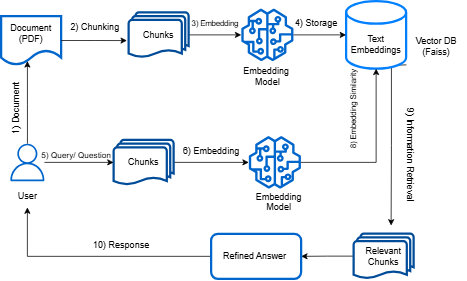

# Chat with PDFs Model 📄🤖

This project allows users to interact with any PDF document, ask questions, and receive insightful answers in real-time. Users can choose between two AI models: OpenAI (paid) for advanced responses or Hugging Face (free) for budget-friendly access.

Built with the **Langchain** framework, the project uses **embeddings** to represent the content of PDFs and stores them in a **FAISS vector database** for efficient retrieval.
## Workflow

## Key Features:
- **Dual Model Support**:
  - **OpenAI (Paid)**: For high-quality, advanced responses.
  - **Hugging Face (Free)**: For budget-friendly access, leveraging state-of-the-art free models.
  
- **Langchain Framework**: Built using the **Langchain** framework, which simplifies working with language models and embeddings. This enables seamless integration of advanced NLP workflows like conversational chains and text retrieval.

- **Embeddings & Vector Databases**: 
  - Text from PDFs is processed using **OpenAI Embeddings** or **Hugging Face Embeddings** (depending on the user's choice). These embeddings transform the content into vector representations that capture semantic meaning.
  - **Why Embedding?** Embedding is the process of converting text into numerical vectors that capture the meaning of the content. This enables comparison of documents based on their meaning rather than raw text. By embedding the text, the model can better understand the context of words and phrases, resulting in more accurate information retrieval.
  - The embeddings are stored in a **FAISS vector database** for fast and accurate retrieval during user interactions.

- **Conversation Memory**: The system uses **ConversationBufferMemory** to maintain a smooth chat experience by storing the context of the conversation, making interactions feel natural and continuous.

## Workflow:
To ensure a smooth experience, the process is structured as follows:

1. **Document Upload**: Users upload PDF documents via the app interface.
2. **Text Extraction**: The text is extracted from the PDF files, split into smaller chunks for better handling of long documents.
3. **Embedding Generation**: Using **OpenAI Embeddings** or **Hugging Face Embeddings**, the text chunks are converted into vector representations that capture the meaning of the content.
4. **Storing in Vector Database**: The embeddings are stored in a **FAISS vector database** for fast retrieval, ensuring efficient question answering.
5. **Conversational Interface**: After processing the documents, users can ask questions about the content. The system retrieves the most relevant information based on the embeddings and context, providing real-time responses.
6. **Conversation Memory**: The system remembers the conversation history, enabling a coherent and continuous flow of dialogue as users interact with the model.

## Requirements:
- Python 3.9
- Streamlit
- Langchain
- PyPDF2
- Hugging Face or OpenAI API (depending on the model you want to use)
- FAISS
- dotenv

